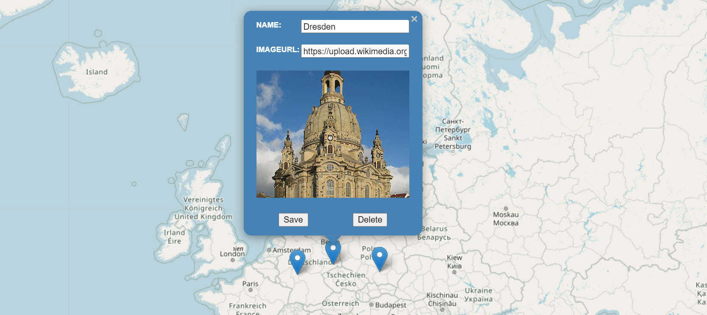

# Getting Started with VisitedPlaces App

Visited places App - What it does?

User can place markers on all the visited places on the map.
User can click anywhere on the map and the place will be added, with an exception when you click on water and outside the scope of the current map. Defaultly a name is provided for the visited place. You can edit name or provide an image URL and save your updated data. Providing a valid URL will render the image in popup. Also, you can delete the visited places.\
When you start the application, a default location is shown as a visited place (Dresden) to give the user a feel of how a visited place information looks!

# Backend

To run backend :\
cd <_backendFolder_>\
npm install\
npm run watch

# Frontend

To run frontend :\
cd <_clientFolder_>\
npm install\
npm start
